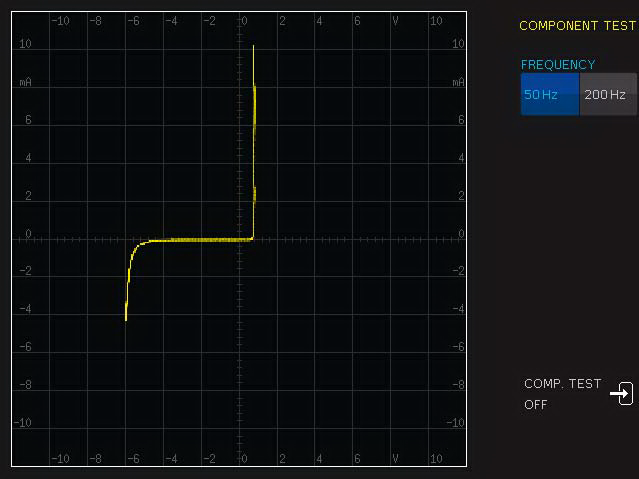
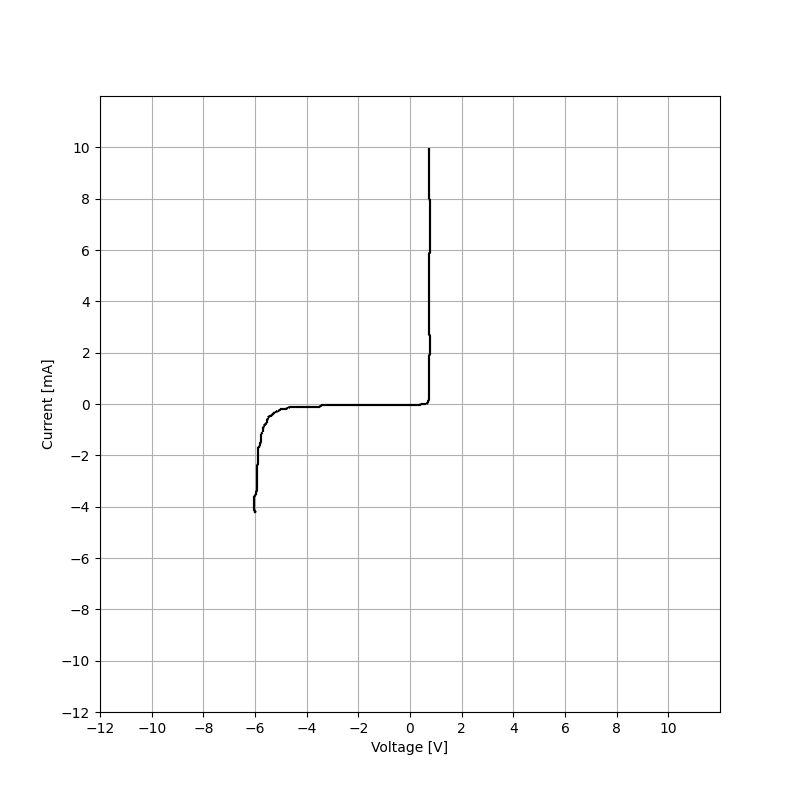

# RTC1000-ct-export
Script to analyze and export vectorized component tester output curves from Rohde &amp; Schwarz RTC1000 (RTC1002) oscilloscopes.

Normally, Rohde &amp; Schwarz oscilloscopes support exporting waveforms. This means that the trace data on the screen can be saved onto a computer and can be analyzed point by point. This feature is however not available when using the "Component Tester" feature of Rohde &amp; Schwarz RTC1000 (RTC1002) oscilloscopes. (With this feature the user can analyze different electronic components, more details about the oscilloscope can be found on the [official website](https://www.rohde-schwarz.com/products/test-and-measurement/oscilloscopes/rs-rtc1000-oscilloscope_63493-515585.html).)

While exporting waveforms is not possible, the device can take screenshots in "Component Tester" mode.

To overcome the limitation of not being able to export the trace data directly, this script loads the screenshot image file that is taken while analyzing a component, and generates a CSV file and a plot of the trace data, based only on the screenshot. It extracts the voltage-current value pairs from the curve on the screenshot, exports it in a text-based format, and also saves a plot of the trace data.

Using this script, from these not-so-good-looking screenshots:



We can generate a nice, high-resolution, print-friendly plot:



Besides the plots, the data is also exported in CSV format. Here is an example (the actual file is usually longer and contains more points - if there are more current values for a specific voltage, for example with capacitors, all the values are being saved):

| Voltage [V]       | Current [mA]       |
|-------------------|--------------------|
| -6.02643171806167 | -4.17621145374449  |
| -5.76211453744493 | -1.4273127753304   |
| -4.81057268722467 | -0.211453744493392 |
| -3.43612334801762 | -0.052863436123348 |
| -2.22026431718062 | -0.052863436123348 |
| -1.74449339207048 | -0.052863436123348 |
| -0.79295154185022 | -0.052863436123348 |
| 0                 | -0.052863436123348 |
| 0.687224669603524 | 0.105726872246696  |
| 0.740088105726872 | 9.09251101321586   |

## How to use

Clone this repository.

Place the screenshot in the same folder as the script, and after that, run the script with the screenshot as an argument:

```bash
$ python3 RTC1000-ct-export.py RTC1000-ct-sample.png
```

## Requirements

The script is written in Python, and it uses the following packages:
- numpy
- cv2
- scipy
- skimage
- matplotlib
- csv
- datetime
- sys
